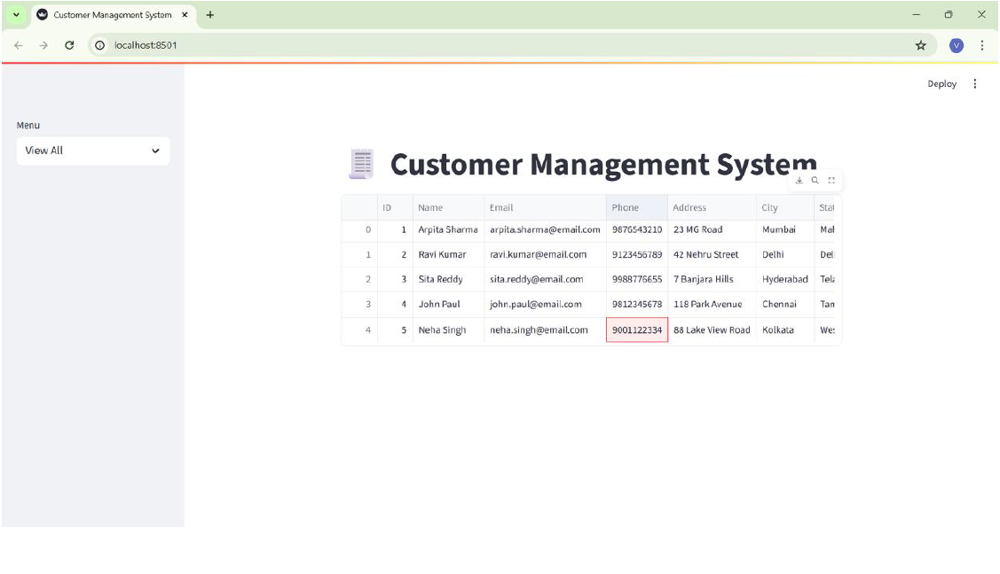
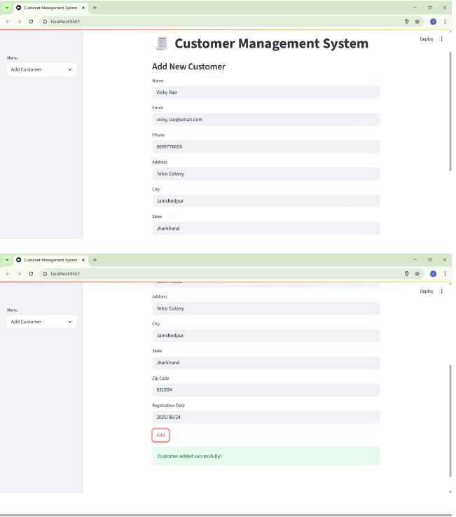
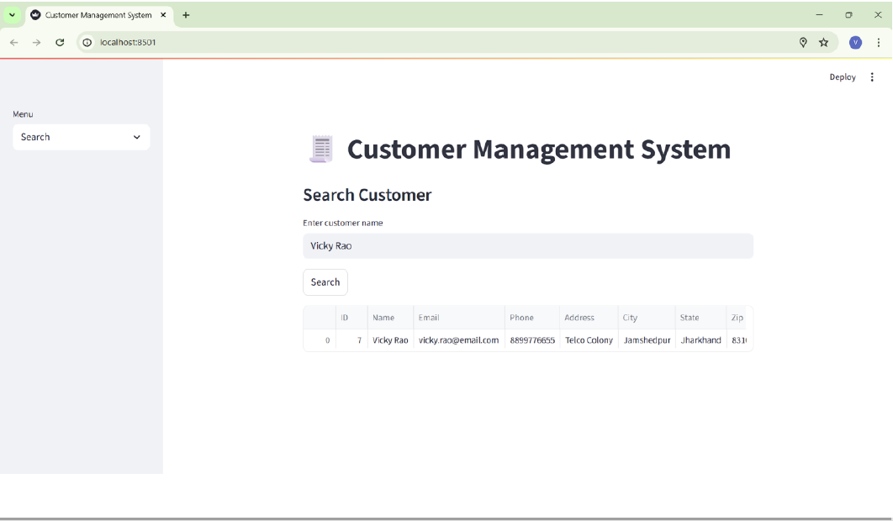
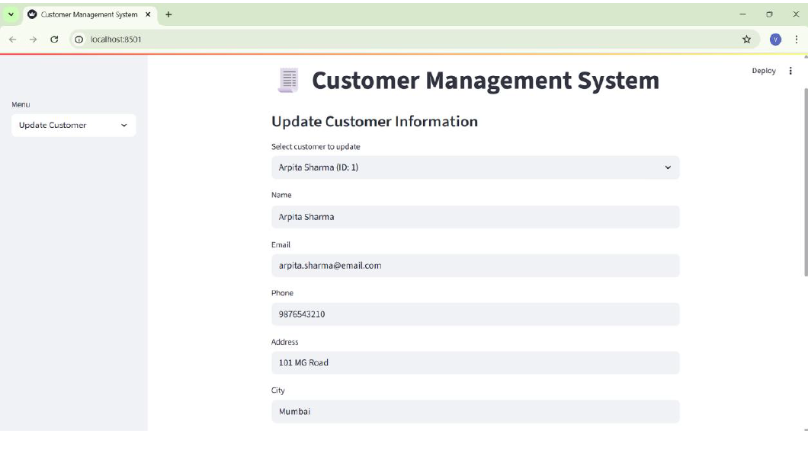
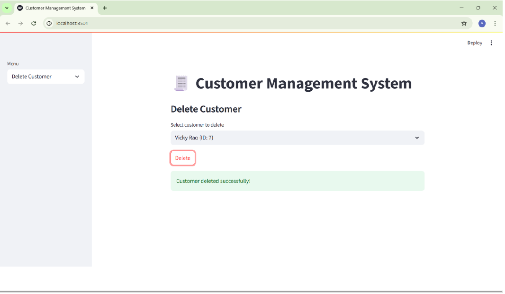

# 🧾 Customer Management System (CMS)

A web-based Customer Management System built using **Python, Streamlit, and MySQL**.  
This application allows users to manage customer records through full CRUD operations.

---

## 🚀 Features

- View All Customers  
- Add New Customer  
- Search Customer by Name  
- Update Customer Information  
- Delete Customer  

---

## 🛠 Tech Stack

- Python 3.10
- Streamlit
- MySQL
- mysql-connector-python
- Pandas

---

## 📂 Project Structure

customer_management_system/
│
├── app.py
├── requirements.txt
│
├── database/
│   └── schema.sql
│
├── screenshots/
│   ├── Add Customers.png
│   ├── Delete Customer.png
│   ├── Search Customer.png
│   ├── Update Customer.png
│   └── View All.png
│
└── README.md

---

## ⚙️ How to Run the Project

### 1️⃣ Clone the Repository

git clone https://github.com/raodesk1217-decoder/customer_management_system.git

cd customer_management_system

---

### 2️⃣ Install Required Packages

pip install -r requirements.txt

---

### 3️⃣ Setup Database

Open MySQL Workbench and run the SQL code inside:

database/schema.sql

---

### 4️⃣ Run the Application

streamlit run app.py

Then open in browser:

http://localhost:8501

---

## 📸 Application Screenshots

### 🔹 View All Customers

### 🔹 Add Customer

### 🔹 Search Customer

### 🔹 Update Customer

### 🔹 Delete Customer

---

## 🎯 Project Objective

The objective of this project is to develop a simple and effective Customer Management System that demonstrates:

- Database design using MySQL
- CRUD operations
- Backend and frontend integration
- Data handling with Pandas

---

## 👨‍💻 Author

M Venkateshwar Rao
